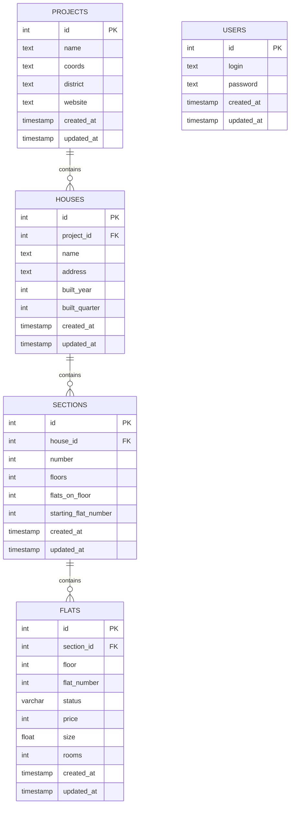

# Real Estate API

REST API проект на Django для управления недвижимостью.

## Структура базы данных


## Установка и запуск

1. Клонировать репозиторий:
```bash
git clone <repository-url>
```

2. Создать и активировать виртуальное окружение:
```bash
python -m venv venv
source venv/bin/activate  # для Linux/Mac
venv\Scripts\activate     # для Windows
```

3. Установить зависимости:
```bash
pip install -r requirements.txt
```

4. Создать admin пользователя:
```bash
python real_estate/manage.py create_admin
```

5. Запустить сервер:
```bash
python real_estate/manage.py runserver
```

**ВАЖНО**: Запуск должен осуществляться именно через `python real_estate/manage.py runserver`, иначе пути могут работать некорректно.

## API Documentation

API документация доступна через Swagger UI после запуска сервера:
- Swagger UI: http://localhost:8000/swagger/
- ReDoc: http://localhost:8000/redoc/

### Авторизация в Swagger:

1. Выполните POST запрос на `/login/` с credentials:
```json
{
    "login": "admin",
    "password": "admin"
}
```

2. Скопируйте полученный token
3. Нажмите кнопку "Authorize" вверху страницы Swagger
4. Введите token в формате: `Bearer <ваш_токен>`
5. После этого все защищенные endpoints станут доступны для тестирования

## API Endpoints

Все endpoints кроме `/login/` требуют авторизацию через Bearer token.

## Структура проекта

```
rest_api_django/
├── real_estate/         # Основной проект
│   ├── api/            # Приложение API
│   │   ├── management/ # Кастомные команды
│   │   ├── migrations/ # Миграции БД
│   │   ├── serializers/# Сериализаторы
│   │   └── views/     # Представления
│   └── real_estate_app/# Настройки проекта
└── venv/               # Виртуальное окружение
```
